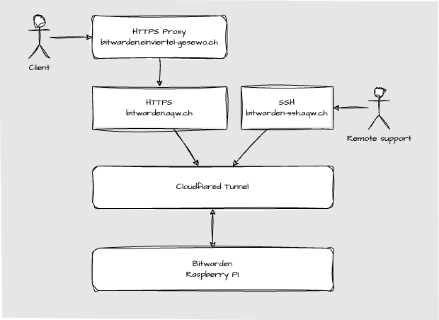

# EinViertel Bitwarden/Vaultwarden Setup



## Raspberry Pi Setup

We use the debian lite image for the Raspberry Pi. Automatic updates are enabled, Docker with Docker Compose is installed plus Watchtower.
Location of the docker compose file is `/home/einviertel/compose/bitwarden`.

- [Install Docker](https://docs.docker.com/engine/install/debian/)

## HTTPS Proxy

TODO: bitwarden.einviertel-gesewo.ch -> bitwarden.aqw.ch

## Cloudflare Tunnel

Follow the instructions on the following page to setup a Cloudflare Tunnel:

- [Cloudflare Tunnel](https://pimylifeup.com/raspberry-pi-cloudflare-tunnel/)

Register booth dns routes for the tunnel:

`cloudflared tunnel route dns bitwarden bitwarden.aqw.ch`
`cloudflared tunnel route dns bitwarden bitwarden-ssh.aqw.ch`

Create tunnel startup config:

`$ cat .cloudflared/config.yml`:

```bash
tunnel: bitwarden
credentials-file: /home/einviertel/.cloudflared/deca80db-e9f5-41d8-b17f-5e75a14d8bec.json

ingress:
    - hostname: bitwarden.aqw.ch
      service: http://localhost:80
    - hostname: bitwarden-ssh.aqw.ch
      service: ssh://localhost:22
    - service: http_status:404
```

Short-lived-cert did not work, so the password login is enabled. Cloudflare zero trust is checking domain of login page, so it is secure.
